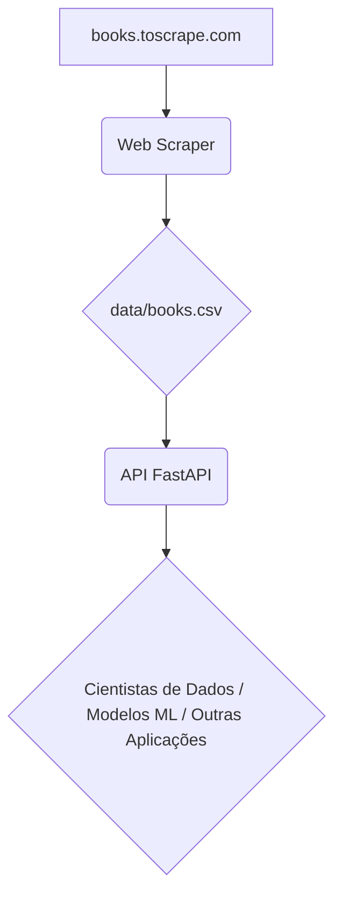

# API Pública de Consulta de Livros:

Este projeto implementa uma API pública para consulta de dados de livros, extraídos de `books.toscrape.com`. O objetivo é fornecer uma infraestrutura de dados escalável e reutilizável para futuros modelos de Machine Learning, especialmente em um contexto de recomendação de livros.

## Arquitetura do Projeto

A arquitetura atual é simples e consiste em:
- Um script de *web scraping* (que gera `data/books.csv`).
- Uma API RESTful desenvolvida com FastAPI para servir os dados.



## Instalação e Configuração

Para executar este projeto localmente, siga os passos abaixo:

1.  **Crie e Ative um Ambiente Virtual** (recomendado para isolar as dependências):
    ```bash
    python -m venv venv
    # No Windows:
    .\\venv\\Scripts\\activate
    # No macOS/Linux:
    source venv/bin/activate
    ```

2.  **Instale as Dependências:**
    ```bash
    pip install -r requirements.txt
    ```

3.  **Execute o comando para iniciar o servidor Uvicorn:**
    ```bash
    uvicorn main:app --host 0.0.0.0 --port 8000 --reload
    ```

-   Após a execução, a API estará disponível em `http://localhost:8000`.
-   A documentação interativa (Swagger UI) estará disponível em: `http://localhost:8000/api/v1/docs`
-   A documentação ReDoc estará disponível em: `http://localhost:8000/api/v1/redoc`

## Rotas da API

A API expõe os seguintes *endpoints*. A documentação interativa completa (Swagger UI) está disponível em `/api/v1/docs` após iniciar a API.

### `GET /api/v1/health`
Verifica o status de saúde da API e a conectividade com os dados.

**Exemplo de Chamada:**
```bash
curl -X GET "http://localhost:8000/api/v1/health"
```

**Exemplo de Resposta (sucesso):**
```json
{
  "status": "OK",
  "message": "API funcionando e dados carregados."
}
```

### `GET /api/v1/books`
Lista todos os livros disponíveis na base de dados. Suporta paginação via `limit` e `offset`.

**Parâmetros de Query:**
- `limit` (opcional, `int`): Número máximo de livros a retornar (padrão: 10, min: 1, max: 100).
- `offset` (opcional, `int`): Número de livros a pular (para paginação, padrão: 0).

**Exemplo de Chamada (primeiros 5 livros):**
```bash
curl -X GET "http://localhost:8000/api/v1/books?limit=5"
```

**Exemplo de Resposta:**
```json
[
  {
    "id": 1,
    "title": "A Light in the Attic",
    "price": 51.77,
    "rating": 3,
    "availability": "In stock",
    "category": "Poetry",
    "image_url": "[http://books.toscrape.com/media/cache/2c/61/2c61093155705cdb24982bb74bb5611f.jpg](http://books.toscrape.com/media/cache/2c/61/2c61093155705cdb24982bb74bb5611f.jpg)"
  },
  {
    "id": 2,
    "title": "Tipping the Velvet",
    "price": 53.74,
    "rating": 1,
    "availability": "In stock",
    "category": "Historical Fiction",
    "image_url": "[http://books.toscrape.com/media/cache/c0/8a/c08a9dd7817f39446d7e63b49911e35d.jpg](http://books.toscrape.com/media/cache/c0/8a/c08a9dd7817f39446d7e63b49911e35d.jpg)"
  }
]
```

### `GET /api/v1/books/{book_id}`
Retorna os detalhes completos de um livro específico pelo seu ID.

**Parâmetros de Path:**
- `book_id` (inteiro, obrigatório): O ID do livro.

**Exemplo de Chamada:**
```bash
curl -X GET "http://localhost:8000/api/v1/books/1"
```

**Exemplo de Resposta:**
```json
{
  "id": 1,
  "title": "A Light in the Attic",
  "price": 51.77,
  "rating": 3,
  "availability": "In stock",
  "category": "Poetry",
  "image_url": "[http://books.toscrape.com/media/cache/2c/61/2c61093155705cdb24982bb74bb5611f.jpg](http://books.toscrape.com/media/cache/2c/61/2c61093155705cdb24982bb74bb5611f.jpg)"
}
```

### `GET /api/v1/books/search`
Permite buscar livros por título (parcial ou exato) e/ou categoria.

**Parâmetros de Query:**
- `title` (opcional, string): Título (parcial ou exato) do livro para buscar.
- `category` (opcional, string): Categoria do livro para buscar.

**Exemplo de Chamada (buscar por título):**
```bash
curl -X GET "http://localhost:8000/api/v1/books/search?title=Light"
```

**Exemplo de Chamada (buscar por categoria):**
```bash
curl -X GET "http://localhost:8000/api/v1/books/search?category=Poetry"
```

**Exemplo de Chamada (buscar por título e categoria):**
```bash
curl -X GET "http://localhost:8000/api/v1/books/search?title=Light&category=Poetry"
```

**Exemplo de Resposta:**
```json
[
  {
    "id": 1,
    "title": "A Light in the Attic",
    "price": 51.77,
    "rating": 3,
    "availability": "In stock",
    "category": "Poetry",
    "image_url": "[http://books.toscrape.com/media/cache/2c/61/2c61093155705cdb24982bb74bb5611f.jpg](http://books.toscrape.com/media/cache/2c/61/2c61093155705cdb24982bb74bb5611f.jpg)"
  }
]
```

### `GET /api/v1/categories`
Lista todas as categorias de livros únicas disponíveis na base de dados.

**Exemplo de Chamada:**
```bash
curl -X GET "http://localhost:8000/api/v1/categories"
```

**Exemplo de Resposta:**
```json
{
  "categories": [
    "Childrens",
    "Fantasy",
    "Fiction",
    "Historical Fiction",
    "Poetry",
    "Science",
    "Steampunk"
  ]
}
```
"""